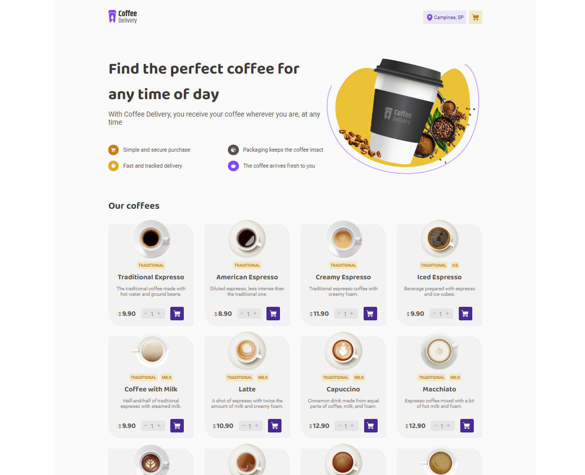
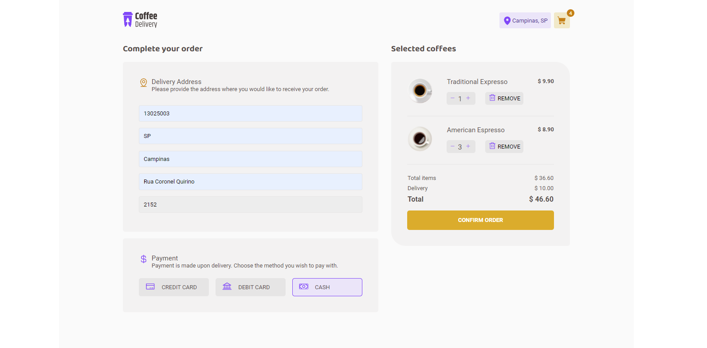
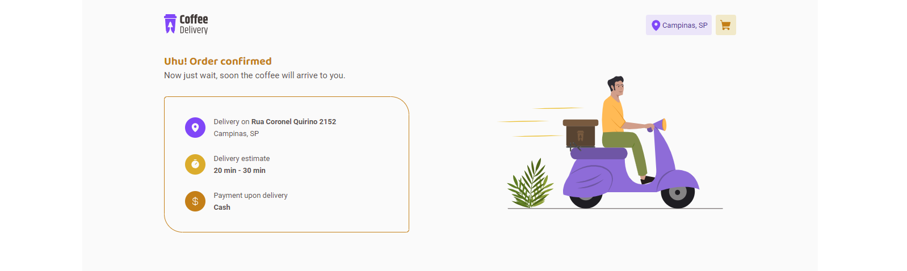

# Coffee Delivery
This project is an application to manage a shopping cart for a *coffee shop*, which includes the following functionalities:

- List available products (coffees) for purchase
- Add a specific quantity of items to the cart
- Increase or decrease the quantity of items in the cart
- A form for the user to fill in their address
- Display the total number of items in the cart in the Header
- Display the total value of the items in the cart multiplied by their price

Although there are only a few functionalities, it require concepts such as:

- States
- ContextAPI
- LocalStorage
- Immutability of state
- Lists and keys in ReactJS
- Properties
- Componentization

### Home

### Checkout

### Success


### Figma
https://www.figma.com/file/5yT9ZzZmRQRS4yivGGB3pl/Coffee-Delivery/duplicate

## Create project
Project name: coffee-delivery
options:
React
TypeScript

> npm create vite@latest

## Configure ESLint
https://eslint.org/docs/latest/use/getting-started
```sh
npm init @eslint/config
✔ How would you like to use ESLint? · problems
✔ What type of modules does your project use? · esm
✔ Which framework does your project use? · react
✔ Does your project use TypeScript? · No / Yes
✔ Where does your code run? · browser
✔ What format do you want your config file to be in? · JavaScript
The config requires the following dependencies:
@typescript-eslint/eslint-plugin@latest eslint-plugin-react@latest @typescript-eslint/parser@latest
✔ Would you like to install them now? · No / Yes
✔ Which package manager do you want to use? · npm
```

## Use styled components
```sh
npm install styled-components
npm install --save-dev @types/styled-components
```

Create a theme `default.ts`
```js
export const defaultTheme = {
  'base-title': '#272221',
...
  'white': '#FFFFFF',
};
```

Create a global style `global.ts`
```js
import { createGlobalStyle } from "styled-components";

export const GlobalStyle = createGlobalStyle`
    * {
        margin: 0;
        padding: 0;
        box-sizing: border-box;
    }
...
    body, input, textarea, button {
        font-family: 'Roboto', sans-serif;
        font-weight: 400;
        font-size: 1rem;
    }
`
```

Injects the theme into all styled components `src/App.tsx`
```js
import { ThemeProvider } from "styled-components"
import { defaultTheme } from "./styles/default"
import { GlobalStyle } from "./styles/global"

function App() {

  return (
    <ThemeProvider theme={defaultTheme}>
      ...
      <GlobalStyle />
    </ThemeProvider>
  )
}
```

## React router dom
```sh
npm install react-router-dom
```
Define the routes for your application:
```js
import { Routes, Route } from 'react-router-dom';

export function Router() {
  return (
    <Routes>
      <Route path='/' element={<Home />} />
      <Route path='/checkout' element={<Checkout />} />
    </Routes>
  );
}
```
To enable the router for the app:
```js
import { Router } from './Router';
import { BrowserRouter } from 'react-router-dom';

function App() {
  return (
    <ThemeProvider theme={defaultTheme}>
      <BrowserRouter>
        <Router />
      </BrowserRouter>
      <GlobalStyle />
    </ThemeProvider>
  );
}
```

## Phosphor react
> npm install phosphor-react

```js
import { ShoppingCart } from 'phosphor-react';

export function Header() {
  return (
    <HeaderContainer>
      <ShoppingCart size={24} weight='fill' />
    </HeaderContainer>
  );
}
```

## HTML Form
https://www.w3schools.com/html/html_forms.asp

## Conditional styling 

```js
export const IconContainer = styled.div<{ $colorTheme: string }>`
  color: ${props => props.$colorTheme === ColorTheme.yellow ? props.theme['yellow-dark'] : props.theme['purple'] };
`;
```

## Component API
The Context API in React provides a means for components to exchange data within an application, offering a simpler alternative to passing props and alleviating the common problem of prop drilling, which arises when numerous layers in the component hierarchy require access to specific data.

### Generic implementation for Context Provider
To make the context API available through the entire app, is a nice solution to use ReactNode as a prop for the context provider. Then wrap the router in the `App.js`.

`context/CartContext.tsx`
```js
import { ReactNode, createContext, useEffect, useState } from 'react';

// Context Provider - props
interface CartContextProviderProps {
  children: ReactNode
}

/** Context */
export const CartContext = createContext({} as CartContextType);

/** Context Provider */
export function CartContextProvider({ children }: CartContextProviderProps) {
  const [cart, setCart] = useState<Order[]>([]);
  function addOrUpdateCart(order: Order) {
    ...
  }

  return (
    <CartContext.Provider value={{ cart, addOrUpdateCart }} >
      {children}
    </CartContext.Provider>
  );
}
```
`App.js`
```js
import { Router } from './Router';
import { BrowserRouter } from 'react-router-dom';
import { CartContextProvider } from './context/ProductContext';

function App() {
  return (
    ...
      <CartContextProvider>
        <BrowserRouter>
          <Router />
        </BrowserRouter>
      </CartContextProvider>
    ...
  );
}
```

### React Router DOM *NavLink* over *href*
Intead of HTML href
```js
<a href='/' target=''></a>
```
Use the *NavLink* from react-router-dom
```js
<NavLink to='/' title='Home '></NavLink>
```
In order to have access to the Context API, because the *context provider* is  wraping the entire `<Route>`
```js
import { Router } from './Router';
import { BrowserRouter } from 'react-router-dom';
import { CartContextProvider } from './context/ProductContext';

function App() {
  return (
    ...
      <CartContextProvider>
        <BrowserRouter>
          <Router />
        </BrowserRouter>
      </CartContextProvider>
    ...
```

## UseReducer
https://react.dev/reference/react/useReducer
```js
const [cart, dispatch] = useReducer(reducerCart, []);
```

`reducer.js`
```js
export function reducerCart(state: OrderType[], action: any) {
  switch (action.type) {
  case ActionTypes.REMOVE: {
    return state.filter(c => c.id !== action.id);
  }
  ...
  default:
    return state;
  }
}
```
`actions.js`
```js
export function addOrUpdateCartAction(order: OrderType) {
  return { 
    type: ActionTypes.ADD_OR_UPDATE, 
    order 
  };
}
```
usage
```js
function addOrUpdateCart(order: OrderType) {
  dispatch(addOrUpdateCartAction(order));
}
```

## Storing states in local storage using React and Context API

The context provider, updates the state in response to changes, and handle storing and retrieving data from local storage.

This pattern uses useEffect in the provider to save changes to local storage whenever the state changes. Also, it retrieves the initial state from local storage when the application loads.
```js
export const MyProvider = ({ children }) => {
  const [myState, setMyState] = useState(() => {
    // Retrieve data from local storage or set default value
    const storedState = localStorage.getItem('myState');
    return storedState ? JSON.parse(storedState) : /* default state */;
  });

  useEffect(() => {
    // Store data in local storage when state changes
    localStorage.setItem('myState', JSON.stringify(myState));
  }, [myState]);
...
```

### Using `useReducer` instead of `useState`

```js
  const [cyclesState, dispatch] = useReducer(
    cycleReducer,
    initialState,
    (initArgs) => {
      const storedStateJSON = localStorage.getItem('@tomato:cycles-state');
      if (storedStateJSON) {
        const parsedState = JSON.parse(storedStateJSON);
        return parsedState;
      }
      return initArgs;
    }
  );

  useEffect(() => {
    // Store data in local storage when state changes
    localStorage.setItem('@tomato:cycles-state', JSON.stringify(cyclesState));
  }, [cyclesState]);
  ...
```


## React + TypeScript + Vite

This template provides a minimal setup to get React working in Vite with HMR and some ESLint rules.

Currently, two official plugins are available:

- [@vitejs/plugin-react](https://github.com/vitejs/vite-plugin-react/blob/main/packages/plugin-react/README.md) uses [Babel](https://babeljs.io/) for Fast Refresh
- [@vitejs/plugin-react-swc](https://github.com/vitejs/vite-plugin-react-swc) uses [SWC](https://swc.rs/) for Fast Refresh

### Expanding the ESLint configuration

If you are developing a production application, we recommend updating the configuration to enable type aware lint rules:

- Configure the top-level `parserOptions` property like this:

```js
   parserOptions: {
    ecmaVersion: 'latest',
    sourceType: 'module',
    project: ['./tsconfig.json', './tsconfig.node.json'],
    tsconfigRootDir: __dirname,
   },
```

- Replace `plugin:@typescript-eslint/recommended` to `plugin:@typescript-eslint/recommended-type-checked` or `plugin:@typescript-eslint/strict-type-checked`
- Optionally add `plugin:@typescript-eslint/stylistic-type-checked`
- Install [eslint-plugin-react](https://github.com/jsx-eslint/eslint-plugin-react) and add `plugin:react/recommended` & `plugin:react/jsx-runtime` to the `extends` list
